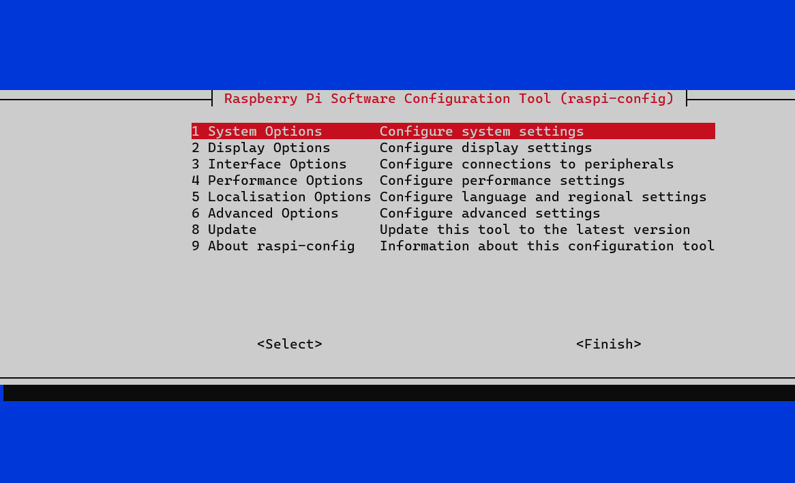

# Local Node Setup

we use raspberry pis for our local nodes

## How

- Install raspberry os light
- Add local user to sudo group
  - `sudo usermod -aG sudo mikec`
- Setup to auto boot with the node user
  - `sudo raspi-config`
  - 
- Enable cgroup memory
  - /boot/firmware/cmdline.txt cgroup_enable=memory cgroup_memory=1
- Add kube repo to native package manager
```
sudo apt-get update
sudo apt-get install -y apt-transport-https ca-certificates curl gnupg
curl -fsSL https://pkgs.k8s.io/core:/stable:/v1.32/deb/Release.key | sudo gpg --dearmor -o /etc/apt/keyrings/kubernetes-apt-keyring.gpg
sudo chmod 644 /etc/apt/keyrings/kubernetes-apt-keyring.gpg
echo 'deb [signed-by=/etc/apt/keyrings/kubernetes-apt-keyring.gpg] https://pkgs.k8s.io/core:/stable:/v1.32/deb/ /' | sudo tee /etc/apt/sources.list.d/kubernetes.list
sudo chmod 644 /etc/apt/sources.list.d/kubernetes.list
sudo apt-get update
```
- install docker
```
curl -sSL https://get.docker.com | sh
sudo usermod -aG docker mikec
```
- dockershm -> cri-docker 
```
wget https://github.com/Mirantis/cri-dockerd/releases/download/v0.3.4/cri-dockerd-0.3.4.arm64.tgz
tar -xvzf cri-dockerd-0.3.4.arm64.tgz
sudo mv cri-dockerd/cri-dockerd /usr/bin/cri-dockerd
sudo chmod +x /usr/bin/cri-dockerd
wget https://raw.githubusercontent.com/Mirantis/cri-dockerd/master/packaging/systemd/cri-docker.service
wget https://raw.githubusercontent.com/Mirantis/cri-dockerd/master/packaging/systemd/cri-docker.socket
sudo mv cri-docker.service /etc/systemd/system/
sudo mv cri-docker.socket /etc/systemd/system/
sudo systemctl enable cri-docker.service
sudo systemctl enable cri-docker.socket
sudo systemctl start cri-docker.service
sudo systemctl start cri-docker.socket
```
- disable swap
  - `sudo apt-get update && sudo apt-get install dphys-swapfile && sudo dphys-swapfile swapoff && sudo dphys-swapfile uninstall && sudo systemctl disable dphys-swapfile`
- install kubernetes
  - `sudo apt install -y kubelet kubeadm kubectl`
  - `sudo apt-mark hold kubelet kubeadm kubectl`
- configure 
  - `sudo kubeadm init --config kubeadm-config.yaml`
- cluster networking (flannel)
  - `kubectl apply -f https://github.com/flannel-io/flannel/releases/latest/download/kube-flannel.yml`
  - Get flannel Working
  ```
  sudo modprobe br_netfilter
  
  sudo nano /etc/modules-load.d/br_netfilter.conf
  #Add the following lines to the file    
   - br_netfilter

  sudo nano /etc/sysctl.d/99-sysctl.conf
  #Add the following lines to the file
   - net.bridge.bridge-nf-call-ip6tables=1
   - net.bridge.bridge-nf-call-iptables=1
   - net.ipv4.ip_forward=1
  ```
- install socat
```
  sudo apt-get -y install socat
```
- Join
  - print join command `kubeadm token create --print-join-command`
  - `sudo kubeadm join 10.0.0.100:6443 --token {token} --discovery-token-ca-cert-hash {hash} --cri-socket unix:///var/run/cri-dockerd.sock --node-name {name}`
